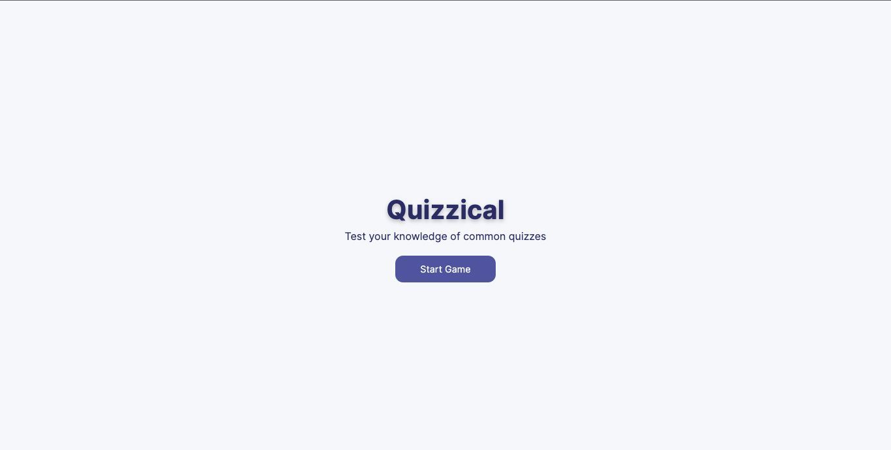

# Quizzical

> A app to test your competence in general knowledge
#### Home Page (Mobile)


- The Home Page of the app

## Built With

- JSX, CSS
- React

# Set Up
## Clone This Repository
```
$ git clone https://github.com/emmyobonyo/quizzical.git
$ cd quizzical
$ git checkout feat-welcome-page
```

## Run Project
```
$ npm install
$ npm start
```

## Run APP in the Broswer
- Open [http://localhost:3000](http://localhost:3000) to view it in your browser.

## Original Figma file
- https://www.figma.com/file/dj8KOTYg04h7tBPIQk1z9e/Quizzical-App-(Copy)?node-id=0%3A1

## 🤝 Contributing

Contributions, issues, and feature requests are welcome!

Feel free to check the [issues page](https://github.com/emmyobonyo/quizzical/issues).

## Show your support

Give a ⭐️ if you like this project!
